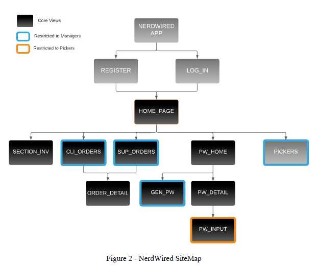
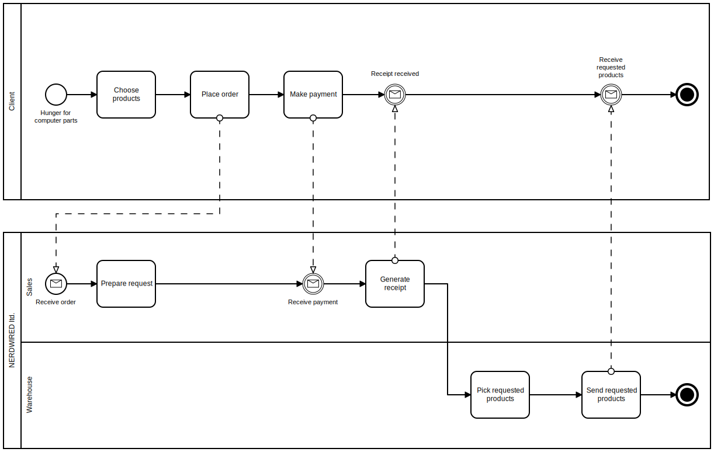
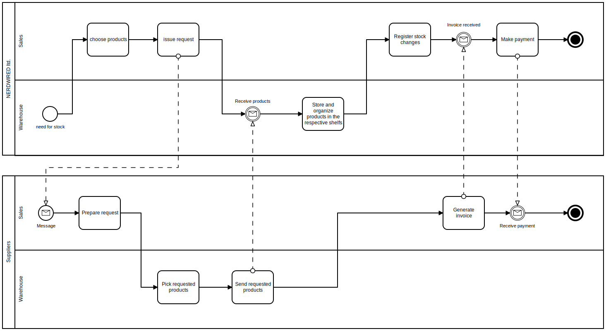

This project consists in the development of a Mobile Application to support the management of all the logistic activity related to a computer parts retailer company, NerdWired. 
It contemplates the purchase and sales process, handles stock replenishment and allocation to warehouse and assists the picking process of a sales order. And It has 2 types of users: managers and pickers.

## SiteMap

## BPMNs

* Final Client BPMN

* Supplier BPMN

## Presentation

[Presentation Slides](./files/4MIEIC04_G_Y_SLIDES.pdf)

## Technologies used

* Jasmin
* React Native
* Firebase

## Steps to build/run the app

#### Download Node.js from https://nodejs.org/en/download/ (LTS, Windows Installer (.msi))
* It will suggest installing Chocolatey as well, do so.

#### Open terminal and type "choco install -y nodejs.install openjdk8"

#### Download and Install Android Studio 
* https://developer.android.com/studio/index.html

#### Once Android Studio is installed, configure SDK

* Click on "Configure" (at the bottom of the "Welcome" window).
*  Open SDK Manager.
*  Select the option "Show package details" (right-bottom).
*  Make sure that "Android 10.0 (Q)", "Android SDK Platform 29" and "Intel x86 Atom_64 System Image" or "Google APIs Intel x86 Atom System Image" are selected.
*  Click on Apply and download whatever is missing.

#### Configure the ANDROID_HOME environment variable 
* https://i.imgur.com/UTFBD3j.png

#### Execute "npm install -g expo-cli" on the Windows PowerShell as Administrator

#### Install Expo App on your smartphone 
* https://play.google.com/store/apps/details?id=host.exp.exponent&hl=pt_PT&gl=US)

#### Open a terminal in the project directory and execute "expo start"

#### Open the app to read the QR code.
* Once scanned, a bundle of js files be downloaded and you should then be able to see the changes made to the app in real time.
